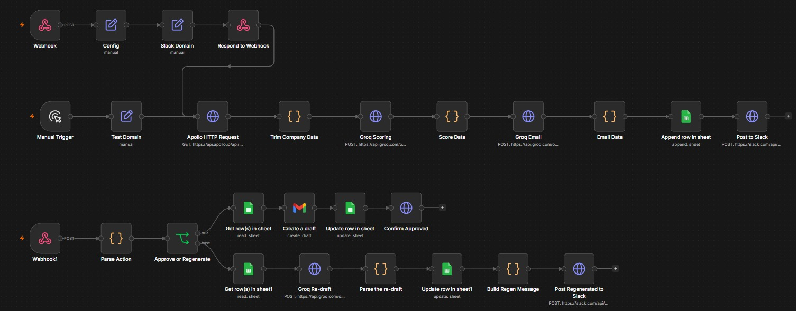
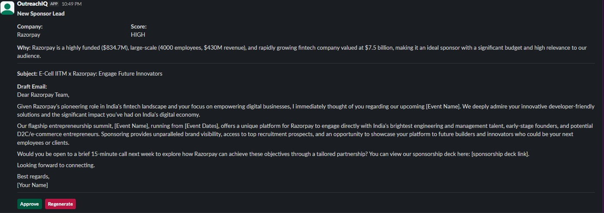
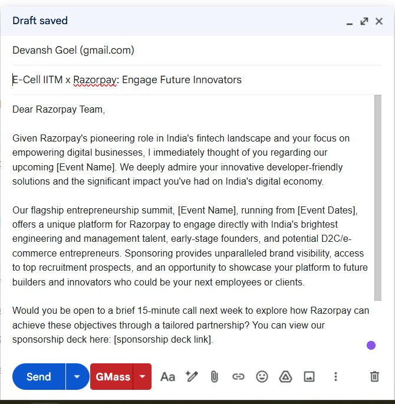

# OutreachIQ

**An AI-powered outreach automation pipeline that turns a single Slack command into a scored, drafted, human-approved sponsorship lead — logged to a CRM, ready to send.**

Type `/enrich <company-domain>` in Slack, and OutreachIQ enriches the company, scores it as a lead, drafts a personalized cold email, logs it, and posts it back for a human to approve or regenerate — all in seconds.

---

## What it does

```
/enrich razorpay.com
        │
        ▼
 Company enrichment        →  Apollo.io (size, revenue, funding, industry, keywords)
        │
        ▼
 AI lead scoring           →  HIGH / MEDIUM / LOW with reasoning  (Groq · Llama 3.3 70B)
        │
        ▼
 AI email drafting         →  personalized cold outreach email
        │
        ▼
 Log to CRM                →  Google Sheets (company, score, draft, status)
        │
        ▼
 Slack approval card       →  [ Approve ]  [ Regenerate ]
        │
   ┌────┴─────┐
   ▼          ▼
Approve     Regenerate
   │          │
 Gmail      fresh draft → back to the card
 draft +
 status:Approved
```

## See it in action

**The pipeline (n8n):**



**Slack approval card — Approve or Regenerate:**



**The resulting Gmail draft:**



The system **proposes**; a human **approves**. Nothing is sent automatically — every email is reviewed by a person before it leaves. The AI does the research, scoring, and drafting; the human stays in control of what actually goes out.

---

## Key features

- **One-command trigger** — `/enrich <domain>` from anywhere in Slack.
- **Automated enrichment** — pulls company size, revenue, funding, and industry signals from Apollo.io.
- **AI lead scoring** — classifies each company HIGH / MEDIUM / LOW with written reasoning, so reps prioritize the right targets.
- **Personalized AI drafting** — generates a tailored cold email that opens with a company-specific hook, not a template.
- **Human-in-the-loop approval** — interactive Slack buttons let a reviewer approve (creates a Gmail draft) or regenerate (produces a fresh alternative).
- **CRM logging** — every lead is tracked in Google Sheets with status (Pending / Approved / Regenerated), creating a built-in acceptance-rate signal.
- **Configurable** — a single config step generalizes the tool to any organization, event, or campaign.

---

## Tech stack

| Layer | Tool |
|---|---|
| Orchestration | n8n |
| Company data | Apollo.io API |
| LLM inference | Groq (Llama 3.3 70B) |
| Messaging + approval UI | Slack (Slash Commands, Block Kit, Interactivity) |
| CRM | Google Sheets API |
| Email | Gmail API |

---

## How it works (architecture)

Two webhook entry points drive the system:

1. **`/enrich` command** → enrich → score → draft → log → post approval card to Slack.
2. **Button actions** (`approve` / `regenerate`) → on approve, look up the lead, create a Gmail draft, mark it Approved; on regenerate, produce a new draft, update the record, and re-post the card.

A trimming step reduces the enrichment payload by ~90% before it reaches the LLM, cutting token cost and keeping the pipeline within free-tier limits.

---

## Setup

1. Import `workflow.json` into your n8n instance.
2. Add your own credentials for: Apollo.io, Groq, Slack (bot token + signing), Google (Sheets + Gmail OAuth).
3. Create a Slack app with a `/enrich` slash command and Interactivity enabled, pointing at your n8n webhook URLs.
4. Set your organization/event details in the config step.
5. Publish the workflow and fire `/enrich <domain>`.

> Credentials are referenced, not included. You supply your own keys.

---

## Roadmap

See [`docs/v2-roadmap.md`](docs/v2-roadmap.md) for planned enhancements, including hybrid LLM routing (cheap model for scoring, stronger model for generation), automated contact discovery, always-on hosting, and acceptance-rate analytics — each with the reasoning behind why it was scoped for a later iteration.

---

## Why human-in-the-loop

OutreachIQ automates the expensive 90% — research, scoring, drafting, logging — while keeping a person on the final decision of what gets sent and to whom. That's a deliberate design choice: it keeps outreach personal, prevents the AI from sending anything unreviewed, and produces a measurable trust signal (how often the AI's drafts are approved as-is).
